# LogicLab architecture

This document describes the implemented Universal static-analysis path. The much
longer `kientruc.md` remains a forward-looking design record and should not be
read as a list of already implemented runtime capabilities.

```mermaid
flowchart LR
    UI[React workbench] -->|HttpOnly session / REST| API[FastAPI control plane]
    API --> DB[(SQLAlchemy + Alembic)]
    API -->|202 durable record| JOB[Repository analysis manager]
    JOB --> FETCH[Bounded Git subprocess]
    FETCH --> OBJECTS[(Bare Git objects)]
    OBJECTS --> MAT[No-checkout materializer]
    MAT --> SNAP[Immutable text snapshot]
    SNAP --> IR[Universal inventory + normalized IR]
    IR --> DAG[Eight-role deterministic DAG]
    DAG --> BB[Claims + provenance + conflicts]
    BB --> DB
    DB --> API
```

## Control plane

- `api.py` owns authentication, security headers, HTTP contracts, background job
  dispatch, pagination, and same-origin UI delivery.
- `storage.py` persists jobs, reports, claims, task views, findings, and audit
  events. Runtime startup upgrades the schema through Alembic; `create_schema`
  exists only for isolated tests.
- `repository_analysis.py` owns the queued → fetching → analyzing → terminal
  state machine and projects normalized claims into typed provenance views.

## Untrusted repository boundary

- `snapshots.py` accepts only credential-free HTTPS URLs from configured public
  forges and an exact commit SHA.
- Git runs without prompts, proxy environment, redirects, system/global config,
  or non-HTTPS helper protocols. Transfer time and on-disk bytes are monitored.
- The materializer reads the pinned Git tree directly. It never checks out hooks,
  filters, submodules, or symlinks and writes only regular UTF-8 text blobs into a
  dedicated root.
- Omitted content is part of the report denominator and forces partial review.

## Program intelligence

- `intelligence.py` performs bounded inventory, ecosystem/build discovery,
  component segmentation, Python AST analysis, conservative generic extraction,
  and normalized IR generation.
- Understanding and runtime are separate capability axes. Static parsing cannot
  increase runtime permission.
- `harness.py` defines role/task contracts, budgets, DAG transitions, blackboard
  claims, provenance, conflict reduction, abstention, and stop rules. It owns no
  I/O: it imports no filesystem, network, or subprocess module.
- `roles.py` is the executor. Each role projects the evidence it owns into cited
  claims — components from manifests, symbols from the IR, entry points, build
  systems, test-shaped paths, per-component capability. A claim is only emitted
  when its path carries a snapshot blob digest; a role with no usable evidence
  abstains with a typed reason instead of reporting success.
- The `INDEPENDENT_SKEPTIC` adjudicates conflicts deterministically by evidence
  strength: epistemic rank first, then citation count. When both tie the conflict
  stays `UNRESOLVED` rather than being broken arbitrarily.
- Budgets are enforced, not merely declared: `TaskDAG` accumulates `BudgetUsage`
  per task and applies `StopRules`, and role `max_parallelism` gates dispatch.
- Every non-success outcome carries a next step. Abstentions, capability
  ceilings, role crashes, and scheduler-blocked tasks all name what would
  unblock them, and that reaches the report and the UI.
- Recovery is closed: a role crash becomes a typed `ERROR` with a recovery
  contract instead of killing the analysis, `TaskDAG.retry_task` returns it to
  the ready pool, and `StopRules` fails it once the retry budget is spent. Every
  other role still contributes its claims.
- Claim identity is reproducible. `created_at` is excluded from the claim hash
  material, so the same commit yields the same `claim_id` in every run.

## Optional semantic proposer

`proposals.py` lets a local model propose the semantic claims that parsing
cannot establish. It is **disabled by default** (`LOGICLAB_PROPOSER_ENABLED`).
When enabled it may only propose `behavior`, `intent`, `security_control`, and
`data_model` claims, may only cite paths from an allow-list of materialized
analyzable files, and every admitted claim is forced to `INFERRED` — so it can
never outrank an `OBSERVED` or `DERIVED` claim when the skeptic adjudicates a
conflict in the same group. Rejected proposals become diagnostics. A proposer
failure degrades the role to `PARTIAL`; it never fails the analysis.

Enabling it trades reproducible *interpretation* for semantic reach while the
evidence substrate stays reproducible, and the distinction remains visible in
the output as an epistemic status.

## UI

The Vite/React application in `ui/` has eight routes: overview, repository list,
repository dossier, role tasks, Project Twin, runs, findings, and system policy.
It validates API contracts fail-closed, polls non-terminal jobs, exposes snapshot
and blob digests, and never stores the API token in browser storage.

## Legacy isolation

The original TLS experiment orchestrator, Docker lab, Ollama hunter/verifier, and
replay path remain available for the original curated experiment. Universal API
runtime mutations and the legacy worker are disabled unless
`LOGICLAB_LEGACY_RUNTIME_ENABLED=true` is explicitly configured. Arbitrary
repository runtime execution is not an implemented Universal capability.
